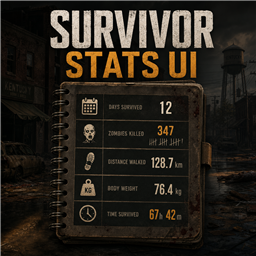

# Survivor Stats UI

Mod independente e sem dependencias para Project Zomboid Build 42.20.

## Estrutura

- `common/`: metadados, arte e traducoes compartilhadas.
- `42.20/`: codigo Lua exclusivo da Build 42.20.
- `workshop.txt` e `preview.png`: publicacao no Steam Workshop.

## Recursos da versao 1.1.0

- Painel arrastavel e recolhivel.
- Painel redimensionavel pela alca no canto inferior direito.
- Dias sobrevividos e tempo real jogado por personagem.
- Total de zumbis abatidos.
- Distancia percorrida persistente e separada por personagem.
- Peso corporal atual.
- Indicador verde/vermelho para ganho ou perda de peso.
- Traducoes em portugues brasileiro e ingles.
- Nenhuma dependencia externa.
- Conjunto proprio de icones de estatisticas incorporado ao painel.
- Barra visual com o progresso do dia atual no mundo.

O arquivo de configuracao visual e criado em `Zomboid/Lua/SurvivorStatsUI.ini`.
Os dados de cada personagem ficam em `ModData`, junto ao proprio save.

## Instalacao local

Copie a pasta `SurvivorStatsUI` para `Zomboid/Workshop` e ative o mod
`SurvivorStatsUI` no menu de mods. Para atualizar o item publicado, abra
`Workshop > Seus itens > Survivor Stats UI` dentro do jogo e envie novamente.

## Desenvolvimento

O codigo cliente fica em:

`Contents/mods/SurvivorStatsUI/42.20/media/lua/client/SurvivorStatsUI`

Consulte [CHANGELOG.md](CHANGELOG.md) para o historico da versao.

## Licenca

Copyright (c) 2026 PIGZEIRA. Todos os direitos reservados. Consulte
[LICENSE.md](LICENSE.md).
